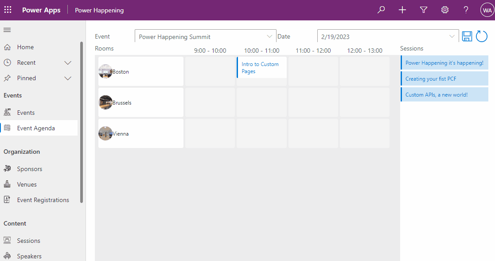

# Power Happening
Power Happening! It's Happening! An event organizer Model-Driven Power App.

This is a community sample to inspire you how you can use Model-Driven Power Apps and Custom Pages for your business processes.

Use this solution to manage your next Power Platform event. Add and manage speakers, sessions, attendees and venues.
After you add Rooms to your Venue and Slots on Event Days you can use our Custom Page Agenda Scheduler:

# Installation manual

To install this solution to your Dataverse enabled environment you also need the following:
* Creator Kit
* Drag and Drop

Then you can install our solution.
For a more detailed description on how to install the solution go to our [project wiki](https://github.com/BendenBlanken/PowerHappening/wiki/1.-Installation-Manual).

# User manual
We are also working on documentation how to use our solution. You can find a [first version here](https://github.com/BendenBlanken/PowerHappening/wiki/2.-User-manual).

# Issues or ideas
If you are using this app for organizing your event ánd you have good ideas or find issues. Please go ahead and [create issues](https://github.com/BendenBlanken/PowerHappening/issues/) on our repository.

# Authors
This sample is created and maintained by:
* Wilmer Alcivar - [LinkedIn](https://www.linkedin.com/in/wilmeralcivar/) - [GitHub](https://github.com/walcivar).
* Ben den Blanken - [LinkedIn](https://www.linkedin.com/in/bendenblanken/) - [GitHub](https://github.com/BendenBlanken) - [Twitter](https://twitter.com/BenDenBlanken).
